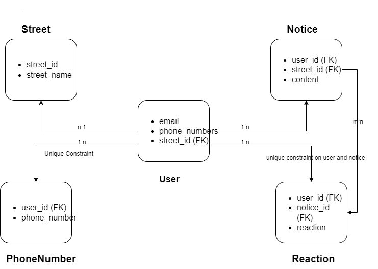
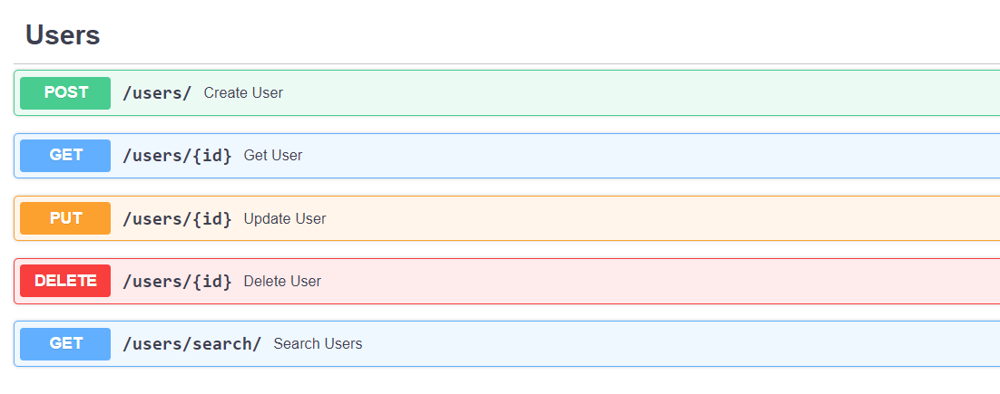
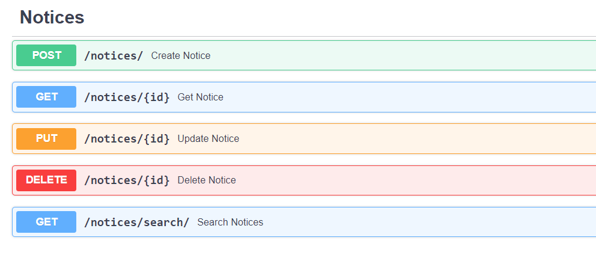
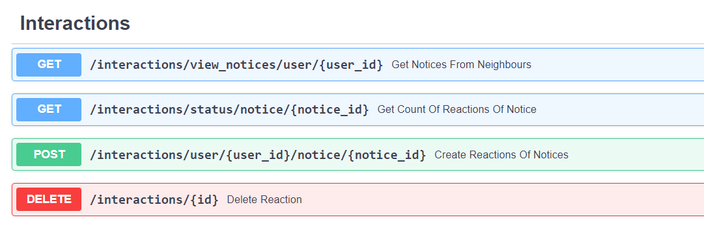

# Neighbourhood Notice Board
A simple python web app using Fast API.
## Business Logic
 - Allow users to register with address and contact information.
 - Users can post notices and edit them.
 - Neighbors on the same street share a notice board and can see each others post.
 - Neighbors can react to the notices.
## Tech stack
 - Fast API: An JSON based API is built to support the business logic.
 - Pydantic: Define request and response models and schema validation 
 - SQLAlchemy: ORM for database
 - Pytest: Used for testing the API. Detailed testing is skipped due to time constraint.
 - Docker: To run the database and later on the application.
 - Postgres: Database
## Design

## API

[Open API](documentation/openapi.json) swagger API definitions are available in documentation directory.

#### Users can register or search each other using:

#### CRUD operations on Notices

#### API to react on the posted Notices

